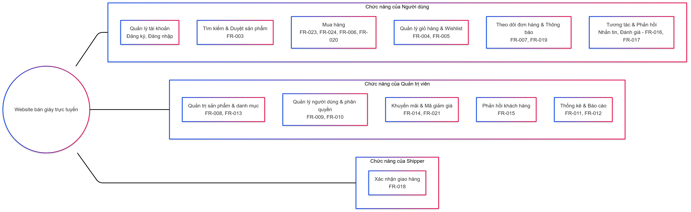

= Sơ đồ BFD mức 0
Dựa trên các chức năng nghiệp vụ cốt lõi đã liệt kê, sơ đồ phân rã chức năng (BFD) mức 0 sẽ chia hệ thống thành các khối nghiệp vụ chính, với hệ thống được xem như một “hộp đen” xử lý trung tâm. Dưới đây là phân tích chi tiết:
:toc:

---

### 1. Mục tiêu của BFD Mức 0

BFD mức 0 nhằm cung cấp cái nhìn tổng quát về các chức năng nghiệp vụ cốt lõi của hệ thống mà không đi vào chi tiết xử lý nội bộ. Nó cho thấy cách hệ thống tương tác với các tác nhân bên ngoài thông qua các luồng dữ liệu chính.

---

### 2. Các Khối Nghiệp Vụ Chính

Dựa trên tài liệu SRS, trong sơ đồ BFD mức 0 ta chỉ cần thể hiện các chức năng nghiệp vụ cốt lõi của hệ thống dưới dạng các khối chức năng, không cần đi sâu vào việc mô tả các luồng dữ liệu. Cụ thể, ta có thể phân chia các chức năng thành ba nhóm chính như sau:

---

* Chức năng của Người dùng (Khách hàng)

- **Quản lý tài khoản:**
*** Đăng ký (FR-001)
*** Đăng nhập (FR-002)

- **Tìm kiếm & Duyệt sản phẩm:**
*** Tìm kiếm sản phẩm theo tên, danh mục, loại, thương hiệu, giá cả, kích thước (FR-003)

- **Mua hàng:**
*** Mua hàng từ trang sản phẩm (FR-023)
*** Mua hàng từ trang giỏ hàng (FR-024)
*** Thanh toán (FR-006)
*** Mua hàng với tư cách khách vãng lai (FR-020)

- **Quản lý giỏ hàng & Wishlist:**
*** Thao tác thêm, xóa sản phẩm trong giỏ hàng (FR-004)
*** Quản lý danh sách yêu thích (FR-005)

- **Theo dõi đơn hàng & Thông báo:**
*** Xem trạng thái đơn hàng (FR-007)
*** Xem thông báo từ hệ thống (FR-019)

- **Tương tác & Phản hồi:**
*** Nhắn tin với quản trị viên (FR-016)
*** Đánh giá sản phẩm (FR-017)

*Người dùng khởi tạo các yêu cầu từ việc đăng ký, tìm kiếm, mua hàng, quản lý giỏ hàng cho đến việc theo dõi đơn hàng và phản hồi.*

---

* Chức năng của Quản trị viên (Admin)

- **Quản trị sản phẩm & danh mục:**
*** Quản trị sản phẩm (thêm, sửa, xóa – FR-008)
*** Quản lý danh mục sản phẩm (FR-013)

- **Quản lý người dùng và phân quyền:**
*** Tạo tài khoản cho shipper (FR-009)
*** Quản lý quyền người dùng (FR-010)

- **Khuyến mãi & Mã giảm giá:**
*** Quản lý khuyến mãi (FR-014)
*** Quản lý mã giảm giá (FR-021)

- **Phản hồi khách hàng:**
*** Xem và xử lý phản hồi khách hàng (FR-015)

- **Thống kê & Báo cáo:**
*** Thống kê theo loại giày (FR-011)
*** Thống kê tổng thể website (FR-012)

*Quản trị viên thực hiện các thao tác quản lý dữ liệu liên quan đến sản phẩm, người dùng, khuyến mãi và theo dõi doanh thu của hệ thống.*

---

* Chức năng của Shipper

- **Xác nhận giao hàng:**
*** Xác nhận giao hàng thành công cho khách hàng (FR-018)

*Shipper tiếp nhận yêu cầu giao hàng và xác nhận giao hàng thành công, giúp cập nhật trạng thái đơn hàng.*

---

### 3. Các Tác Nhân Bên Ngoài và Luồng Dữ Liệu Giao Tiếp

- **Khách hàng (Người dùng):**
** Tương tác với các khối Duyệt & Tìm kiếm, Giỏ hàng, và Đặt hàng & Thanh toán.
** Nhận thông tin sản phẩm, xác nhận đơn hàng và cập nhật trạng thái đơn hàng.

- **Quản trị viên (Admin):**
** Tương tác với khối Quản trị Hệ thống để quản lý sản phẩm, danh mục, người dùng, khuyến mãi, phản hồi và thống kê doanh thu.

- **Shipper:**
** Tương tác với khối Quản lý Đơn hàng & Giao hàng để nhận thông tin đơn hàng cần giao và gửi xác nhận giao hàng thành công.

- **Cổng thanh toán:**
** Được tích hợp trong quy trình Đặt hàng & Thanh toán để xử lý giao dịch và phản hồi kết quả thanh toán.

---

### 5. Sơ đồ BFD Mức 0
