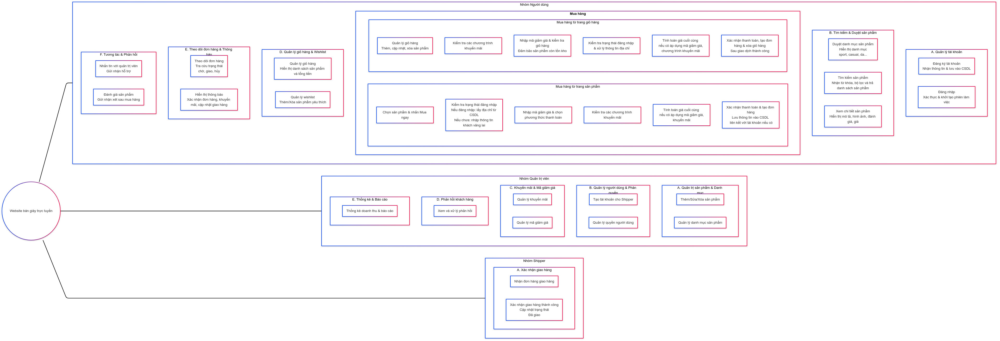

= Sơ đồ BFD Mức 1 website bán giày
:toc:

Sơ đồ BFD mức 1 là bước phân rã chi tiết hơn từ sơ đồ BFD mức 0, giúp ta xác định rõ ràng hơn các hoạt động con (task/hoạt động) cụ thể mà hệ thống cần thực hiện để hoàn thành mỗi chức năng nghiệp vụ cốt lõi. Dưới đây là phân tích sơ đồ BFD mức 1 cho dự án website bán giày trực tuyến:

---

### 1. Mục Tiêu của BFD Mức 1

- **Mục tiêu:**
Phân rã các chức năng nghiệp vụ cốt lõi (đã được xác định ở mức 0) thành các hoạt động con chi tiết, đảm bảo mọi quy trình kinh doanh quan trọng đều được mô tả đầy đủ. Điều này không chỉ giúp cho việc xây dựng sơ đồ DFD mức 1 mà còn tạo nền tảng cho thiết kế hệ thống cụ thể sau này.

- **Quy tắc:**
Mỗi chức năng được đặt tên theo mệnh đề động từ, phản ánh nhiệm vụ thực tế và không trùng lặp, đảm bảo tính trực quan và rõ ràng.

---

### 2. Phân Rã Chi Tiết Các Chức Năng Nghiệp Vụ

### Phân rã chức năng của Người dùng (Khách hàng)

A. Quản lý tài khoản

    * Đăng ký tài khoản:
        ** Nhận thông tin đăng ký (email, số điện thoại, thông tin cá nhân).
        ** Xác thực dữ liệu và lưu thông tin vào cơ sở dữ liệu.
    * Đăng nhập:
        ** Nhận thông tin đăng nhập (tên người dùng, mật khẩu hoặc đăng nhập qua tài khoản bên thứ ba).
        ** Xác thực thông tin, khởi tạo phiên làm việc (session).

B. Tìm kiếm & Duyệt sản phẩm

    * Duyệt danh mục sản phẩm:
        ** Hiển thị các danh mục (sport, casual, giày da, giày lười, …).
        ** Cho phép người dùng lựa chọn danh mục để duyệt sản phẩm.
    * Tìm kiếm sản phẩm:
        ** Nhận yêu cầu tìm kiếm theo từ khóa và bộ lọc (loại, thương hiệu, giá, kích thước).
        ** Hiển thị danh sách sản phẩm phù hợp với tiêu chí tìm kiếm.
    * Xem chi tiết sản phẩm:
        ** Khi người dùng chọn một sản phẩm, hiển thị đầy đủ thông tin (mô tả, hình ảnh, đánh giá, giá cả).

C. Mua hàng:
Quy trình mua hàng được chia thành hai luồng chính:

    * Mua hàng từ trang sản phẩm:
        ** Người dùng chọn sản phẩm và nhấn “Mua ngay”.
        ** Kiểm tra trạng thái đăng nhập (nếu đăng nhập thì lấy thông tin địa chỉ từ CSDL, nếu chưa thì nhập thông tin khách vãng lai).
        ** Nhập mã giảm giá (nếu có) và chọn phương thức thanh toán.
        ** Kiểm tra các chương trình khuyến mãi
        ** Thực hiện tính toán giá cuối cùng (nếu co áp dụng mã giả giá, chương trình khuyến mãi)
        ** Xác nhận thanh toán và tạo đơn hàng, lưu thông tin vào CSDL (liên kết với tài khoản nếu có).
    * Mua hàng từ trang giỏ hàng:
        ** Người dùng quản lý giỏ hàng (thêm, cập nhật, xóa sản phẩm).
        ** Kiểm tra các chương trình khuyến mãi
        ** Nhập mã giảm giá, kiểm tra giỏ hàng (đảm bảo sản phẩm còn tồn kho).
        ** Kiểm tra trạng thái đăng nhập và xử lý thông tin địa chỉ.
        ** Thực hiện tính toán giá cuối cùng (nếu co áp dụng mã giả giá, chương trình khuyến mãi)
        ** Xác nhận thanh toán, tạo đơn hàng và xóa giỏ hàng sau khi giao dịch thành công.

D. Quản lý giỏ hàng & Wishlist

    * Quản lý giỏ hàng:
        ** Thêm sản phẩm vào giỏ hàng, cập nhật số lượng hoặc xóa sản phẩm.
        ** Hiển thị danh sách sản phẩm trong giỏ cùng tổng số tiền tạm tính.
    * Quản lý wishlist:
        ** Thêm sản phẩm vào danh sách yêu thích.
        ** Xóa sản phẩm khỏi wishlist và nhận thông báo khi sản phẩm có hàng trở lại.

E. Theo dõi đơn hàng & Thông báo

    * Theo dõi đơn hàng:
        ** Tra cứu trạng thái đơn hàng (chờ xử lý, đang giao, đã giao, đã hủy).
    * Thông báo:
        ** Hiển thị thông báo xác nhận đơn hàng, cập nhật trạng thái giao hàng hoặc thông báo khuyến mãi mới.

F. Tương tác & Phản hồi

    * Nhắn tin với quản trị viên:
        ** Gửi và nhận tin nhắn để hỗ trợ giải đáp thắc mắc.
    * Đánh giá sản phẩm:
        ** Cho phép người dùng gửi đánh giá và nhận xét về sản phẩm đã mua.

### Phân rã chức năng của Quản trị viên (Admin)
A. Quản trị sản phẩm & Danh mục

    * Quản trị sản phẩm:
        ** Thêm sản phẩm mới (nhập thông tin chi tiết, hình ảnh, giá, tồn kho,…).
        ** Sửa đổi thông tin sản phẩm.
        ** Xóa sản phẩm (kèm kiểm tra ràng buộc, ví dụ: sản phẩm không còn xuất hiện trong đơn hàng đang xử lý).
    * Quản lý danh mục sản phẩm:
        ** Thêm, sửa, xóa danh mục sản phẩm.
        ** Liên kết sản phẩm với danh mục tương ứng.

B. Quản lý người dùng và Phân quyền

    * Tạo tài khoản cho Shipper:
        ** Nhập thông tin tài khoản shipper và gán quyền phù hợp.
    * Quản lý quyền người dùng:
        ** Cập nhật, phân quyền hoặc vô hiệu hóa tài khoản người dùng theo yêu cầu.

C. Khuyến mãi & Mã giảm giá

    * Quản lý khuyến mãi:
        ** Tạo, sửa, xóa các chương trình khuyến mãi.
    * Quản lý mã giảm giá:
        ** Thiết lập và quản lý mã giảm giá áp dụng cho đơn hàng.

D. Phản hồi khách hàng

    * Xem và xử lý phản hồi:
        ** Tổng hợp các phản hồi, đánh giá từ khách hàng.
        ** Xử lý (phản hồi, gỡ bỏ hoặc chuyển tiếp) theo từng trường hợp cụ thể.

E. Thống kê & Báo cáo

    * Thống kê tình hình kinh doanh:
        ** Tổng hợp doanh thu theo loại giày và tổng quan toàn bộ website.
        ** Hiển thị báo cáo, biểu đồ để quản trị viên theo dõi hiệu suất bán hàng.

### Phân rã chức năng của Shipper
A. Xác nhận giao hàng

    * Nhận đơn hàng giao hàng:
        ** Nhận thông tin đơn hàng cần giao từ hệ thống.
    * Xác nhận giao hàng thành công:
        ** Sau khi giao hàng, cập nhật trạng thái đơn hàng là “Đã giao”.
        ** Thông báo cho hệ thống cập nhật trạng thái cho khách hàng và quản trị viên.

---
### 3. Tổng kết BFD Mức 1
* Tổng Kết BFD Mức 1

** BFD mức 1 của dự án bán giày trực tuyến phân rã các chức năng cốt lõi (theo BFD mức 0) thành các hoạt động cụ thể như sau:

    *** Nhóm Người dùng:
    **** Mỗi quy trình mua hàng, quản lý tài khoản, tìm kiếm sản phẩm, quản lý giỏ hàng, wishlist, theo dõi đơn hàng và tương tác đều được chia nhỏ thành các bước xử lý cụ thể, từ nhập thông tin đến xác nhận giao dịch và hiển thị phản hồi cho người dùng.

    *** Nhóm Quản trị viên:
    **** Các chức năng quản trị như quản lý sản phẩm, danh mục, người dùng, khuyến mãi, phản hồi và báo cáo được phân rã thành các quy trình con nhằm đảm bảo tính chính xác và kiểm soát dữ liệu, đồng thời hỗ trợ việc ra quyết định và theo dõi hiệu suất kinh doanh.

    *** Nhóm Shipper:
    **** Quy trình giao hàng được đơn giản hóa thành các bước nhận đơn hàng và xác nhận giao hàng, nhằm cập nhật trạng thái đơn hàng và thông báo cho khách hàng.

---

### 4. Sơ Đồ BFD Mức 1
