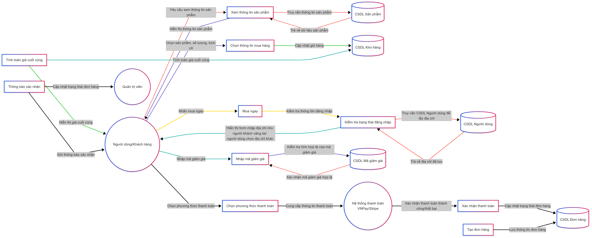

= Sơ đồ DFD mức 1 cho Quy trình Mua hàng từ Trang Sản phẩm
:sectnums:
:icons: font
:imagesdir: 
:source-highlighter: coderay
:toc:

== Thực thể & Kho dữ liệu liên quan:
* Thực thể bên ngoài:

    ** Người dùng/Khách hàng: Thực hiện các thao tác mua hàng, nhập thông tin thanh toán, xem sản phẩm.

    ** Hệ thống thanh toán (Stripe/VNPay): Xử lý giao dịch thanh toán.

    ** Shipper: Nhận thông tin đơn hàng để giao hàng.

    ** Admin: Xem thông tin đơn hàng mới.

* Kho dữ liệu:

    ** CSDL Sản phẩm: Lưu thông tin sản phẩm (giá, tồn kho, mô tả).

    ** CSDL Người dùng: Lưu thông tin tài khoản, địa chỉ đã lưu.

    ** CSDL Đơn hàng: Lưu trữ đơn hàng và trạng thái thanh toán.

    ** CSDL Mã giảm giá: Kiểm tra tính hợp lệ của mã giảm giá.

== Các quy trình chính của Mua hàng từ Trang Sản phẩm:
1. Xem thông tin sản phẩm

    * Luồng dữ liệu:

        ** Người dùng → 1. Xem thông tin sản phẩm: Yêu cầu xem chi tiết sản phẩm.

        ** [1. Xem thông tin sản phẩm] → CSDL Sản phẩm: Truy vấn thông tin.

        ** CSDL Sản phẩm → 1. Xem thông tin sản phẩm: Trả về dữ liệu.

        ** [1. Xem thông tin sản phẩm] → Người dùng: Hiển thị thông tin.

2. Chọn thông tin mua hàng

    * Luồng dữ liệu:

        ** Người dùng → 2. Chọn thông tin mua hàng: Chọn kích thước, số lượng.

        ** [2. Chọn thông tin mua hàng] → CSDL Sản phẩm: Kiểm tra tồn kho.

        ** CSDL Sản phẩm → 2. Chọn thông tin mua hàng: Xác nhận số lượng hợp lệ.

        ** [2. Chọn thông tin mua hàng] → Người dùng: Thông báo nếu vượt tồn kho.

3. Kiểm tra trạng thái đăng nhập

    * Luồng dữ liệu:

        ** Nếu đã đăng nhập:

            *** [3. Kiểm tra đăng nhập] → CSDL Người dùng: Truy vấn địa chỉ.

            *** CSDL Người dùng → 3. Kiểm tra đăng nhập: Trả về danh sách địa chỉ.

            *** Người dùng chọn địa chỉ hoặc thêm mới → 3. Kiểm tra đăng nhập → CSDL Người dùng: Cập nhật địa chỉ (nếu có).

        ** Nếu chưa đăng nhập:

            *** [3. Kiểm tra đăng nhập] → LocalStorage: Kiểm tra thông tin khách vãng lai.

            *** LocalStorage → 3. Kiểm tra đăng nhập: Trả về thông tin (nếu có).

            *** Người dùng nhập thông tin mới → 3. Kiểm tra đăng nhập → LocalStorage: Lưu thông tin.

4. Nhập mã giảm giá

    * Luồng dữ liệu:

        ** Người dùng → 4. Nhập mã giảm giá: Gửi mã (nếu có).

        ** [4. Nhập mã giảm giá] → CSDL Mã giảm giá: Kiểm tra điều kiện (thời hạn, số lần dùng, v.v.).

        ** CSDL Mã giảm giá → 4. Nhập mã giảm giá: Xác nhận hợp lệ.

        ** [4. Nhập mã giảm giá] → 5. Tính toán giá cuối cùng: Áp dụng giảm giá.

5. Tính toán giá cuối cùng

    * Luồng dữ liệu:

        ** [5. Tính toán giá cuối cùng] → CSDL Mã giảm giá/CSDL Sản phẩm: Lấy giá gốc và giảm giá.

        ** [5. Tính toán giá cuối cùng] → Người dùng: Hiển thị tổng tiền (gốc, giảm giá, tổng thanh toán).

6. Chọn phương thức thanh toán

    * Luồng dữ liệu:

        ** Người dùng → 6. Chọn phương thức thanh toán: Nhập thông tin (không lưu trữ).

        ** [6. Chọn phương thức thanh toán] → Hệ thống thanh toán (Stripe/VNPay): Gửi yêu cầu.

7. Xác thực thanh toán

    * Luồng dữ liệu:

        ** Hệ thống thanh toán → 7. Xác thực thanh toán: Phản hồi kết quả (thành công/thất bại).

        ** [7. Xác thực thanh toán] → 8. Tạo đơn hàng: Thông báo kết quả.

8. Tạo đơn hàng

    * Luồng dữ liệu:

        ** [8. Tạo đơn hàng] → CSDL Đơn hàng:

            *** Nếu đã đăng nhập: Lưu user_id, địa chỉ, mã giảm giá (nếu có).

            *** Nếu chưa đăng nhập: Lưu user_id = NULL, thông tin liên hệ trực tiếp.

        ** [8. Tạo đơn hàng] → CSDL Sản phẩm: Trừ tồn kho.

        ** [8. Tạo đơn hàng] → Shipper: Gửi thông tin giao hàng.

        ** [8. Tạo đơn hàng] → Admin: Thông báo đơn hàng mới.

9. Thông báo xác nhận

    * Luồng dữ liệu:

        ** [9. Thông báo xác nhận] → Người dùng: Hiển thị thông báo thành công.

        ** Nếu đã đăng nhập: 9. Thông báo xác nhận → Gửi email xác nhận qua Resend.
== Sơ đồ DFD mức 1 (Mô tả bằng văn bản)

    * Người dùng tương tác với hệ thống qua các quy trình:

        ** Xem sản phẩm → Chọn thông tin → Kiểm tra đăng nhập → Nhập mã giảm giá → Thanh toán → Cập nhật tồn kho → Thông báo xác nhận.

    * Dữ liệu được truyền giữa các kho:

        ** CSDL Sản phẩm (kiểm tra tồn kho, cập nhật tồn kho), CSDL Người dùng (địa chỉ), CSDL Đơn hàng (lưu đơn).

    * Hệ thống thanh toán xử lý giao dịch và phản hồi kết quả.

    * Admin và Shipper nhận thông tin đơn hàng sau khi xử lý.

== Sơ đồ DFD mức 1: Mua hàng từ Trang Sản phẩm

