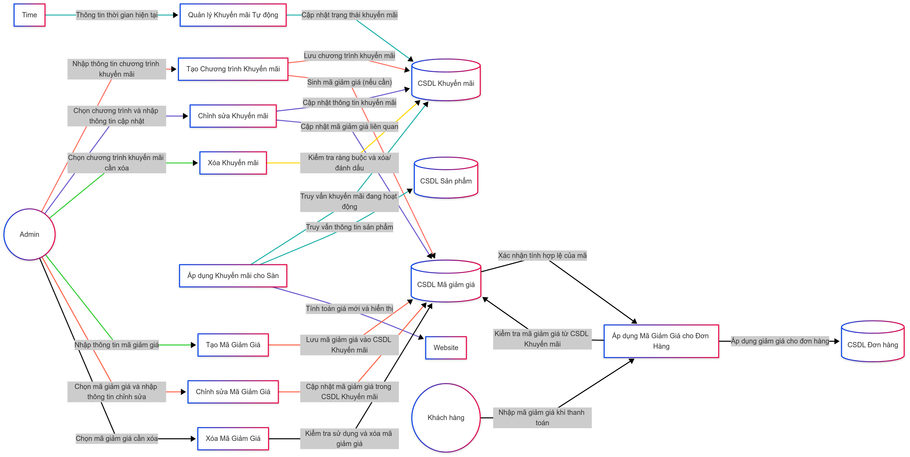

---

## 1. Thực thể và Kho Dữ liệu Liên Quan

- **Thực thể bên ngoài:**
- **Admin:** Quản lý (tạo, chỉnh sửa, xóa) chương trình khuyến mãi và mã giảm giá.
- **Khách hàng:** Sử dụng mã giảm giá khi thanh toán.
- **Hệ thống thanh toán:** Xác thực và áp dụng mã giảm giá vào đơn hàng.

- **Kho dữ liệu:**
- **CSDL Khuyến mãi:** Lưu trữ thông tin chương trình khuyến mãi và mã giảm giá (với các bản ghi được phân biệt theo loại, trạng thái,…).
- **CSDL Sản phẩm:** Chứa thông tin chi tiết sản phẩm, liên kết với các chương trình khuyến mãi (ví dụ: danh mục sản phẩm được áp dụng giảm giá).
- **CSDL Đơn hàng:** Lưu trữ thông tin đơn hàng, bao gồm thông tin về mã giảm giá được áp dụng.

---

## 2. Phân Rã và Luồng Dữ Liệu Chi Tiết giữa Các Quy Trình

### A. Quản lý Chương trình Khuyến mãi

#### 2.1. Tạo Chương trình Khuyến mãi

- **Dữ liệu vào:**
** **Admin:** Nhập thông tin chương trình khuyến mãi bao gồm:
** Tên chương trình
** Loại chương trình
** Giá trị giảm (theo phần trăm)
** Điều kiện áp dụng
** Thời gian bắt đầu và kết thúc
** Danh mục sản phẩm áp dụng (nếu có)
- **Xử lý:**
** Hệ thống thực hiện kiểm tra tính hợp lệ của các thông tin nhập vào (ví dụ: thời gian, mức giảm hợp lý,…).
** Nếu chương trình yêu cầu, hệ thống có thể tạo kèm mã giảm giá (hoặc liên kết với mã giảm giá đã được tạo riêng).
- **Dữ liệu ra:**
** Lưu chương trình khuyến mãi vào **CSDL Khuyến mãi** và thiết lập liên kết với danh mục/sản phẩm cần giảm giá.
** **Luồng dữ liệu tổng quát:**
** **Admin** → [Tạo chương trình khuyến mãi] → Kiểm tra tính hợp lệ → Lưu vào **CSDL Khuyến mãi**

---

#### 2.2. Chỉnh sửa Khuyến mãi

- **Dữ liệu vào:**
** **Admin:** Chọn chương trình khuyến mãi hiện có và nhập thông tin cập nhật (có thể thay đổi mức giảm, thời gian, danh mục áp dụng,…).
- **Xử lý:**
** Hệ thống kiểm tra lại tính hợp lệ của thông tin mới.
** Xác minh chương trình khuyến mãi có tồn tại trong **CSDL Khuyến mãi**.
- **Dữ liệu ra:**
** Cập nhật thông tin của chương trình khuyến mãi trong **CSDL Khuyến mãi** (đồng thời cập nhật liên kết với sản phẩm/danh mục nếu cần).
- **Luồng dữ liệu tổng quát:**
** **Admin** → [Chỉnh sửa khuyến mãi] → Kiểm tra tính hợp lệ & xác minh tồn tại → Cập nhật **CSDL Khuyến mãi**

---

#### 2.3. Xóa Khuyến mãi

- **Dữ liệu vào:**
- **Admin:** Lựa chọn chương trình khuyến mãi cần xóa.
- **Xử lý:**
** Hệ thống kiểm tra xem chương trình khuyến mãi đó có đang được áp dụng cho sản phẩm hoặc liên kết với đơn hàng hiện có hay không.
- **Dữ liệu ra:**
** Nếu chương trình không còn được sử dụng: đánh dấu chương trình là không hoạt động hoặc xóa khỏi **CSDL Khuyến mãi**.
- **Luồng dữ liệu tổng quát:**
** **Admin** → [Xóa khuyến mãi] → Kiểm tra ràng buộc sử dụng → Cập nhật trạng thái/xóa trong **CSDL Khuyến mãi**

---

#### 2.4. Quản lý Khuyến mãi Tự động

- **Dữ liệu vào:**
** **Thông tin thời gian hiện tại:** Được hệ thống lấy từ đồng hồ hệ thống.
** **Trạng thái chương trình khuyến mãi:** Lấy từ **CSDL Khuyến mãi** (bao gồm thời gian bắt đầu và kết thúc đã lưu).
- **Xử lý:**
** Hệ thống chạy quy trình định kỳ (hoặc dựa trên sự kiện thời gian) để so sánh thời gian hiện tại với thời gian bắt đầu/kết thúc của từng chương trình.
** Nếu thời gian hiện tại đã vượt qua thời gian bắt đầu: chuyển chương trình sang trạng thái “đang hoạt động”.
** Nếu thời gian hiện tại vượt quá thời gian kết thúc: tự động chuyển chương trình sang trạng thái “kết thúc” hoặc “không hoạt động”.
- **Dữ liệu ra:**
** Cập nhật trạng thái của các chương trình khuyến mãi trong **CSDL Khuyến mãi**.
- **Luồng dữ liệu tổng quát:**
** [Thông tin thời gian] → [Quản lý khuyến mãi tự động] → Cập nhật trạng thái trong **CSDL Khuyến mãi**

---

#### 2.5. Áp dụng Khuyến mãi cho Sàn

- **Dữ liệu vào:**
** **Chương trình khuyến mãi:** Thông tin các chương trình khuyến mãi đang hoạt động được lấy từ **CSDL Khuyến mãi**.
** **Thông tin sản phẩm:** Lấy từ **CSDL Sản phẩm** để biết giá gốc và các thuộc tính liên quan.
- **Xử lý:**
** Hệ thống truy vấn **CSDL Khuyến mãi** để xác định các chương trình khuyến mãi đang được kích hoạt.
** Sau đó, hệ thống truy vấn **CSDL Sản phẩm** để lấy thông tin chi tiết của từng sản phẩm.
- Thực hiện tính toán:
** Ví dụ: Giá sản phẩm chưa giảm, sau đó tính giá giảm dựa trên mức giảm % của chương trình.
** Kết quả tính toán (giá giảm và giá mới) được gắn vào thuộc tính hiển thị của sản phẩm trên website.
- **Dữ liệu ra:**
** Hiển thị giá sản phẩm khuyến mãi trên sàn thương mại điện tử.
** **Luồng dữ liệu tổng quát:**
** [Truy vấn **CSDL Khuyến mãi** và **CSDL Sản phẩm**] → [Áp dụng khuyến mãi cho sàn] → Tính toán và cập nhật giá hiển thị

---

### B. Quản lý Mã giảm giá

#### 2.6. Tạo Mã giảm giá

- **Dữ liệu vào:**
** **Admin:** Nhập thông tin mã giảm giá, gồm:
- Tên mã giảm giá
** Giá trị giảm (theo phần trăm hoặc số tiền cụ thể)
** Điều kiện áp dụng (ví dụ: giá trị đơn hàng tối thiểu, sản phẩm/danh mục áp dụng)
** Thời gian bắt đầu và kết thúc
- **Xử lý:**
** Hệ thống kiểm tra tính hợp lệ của thông tin nhập vào (thời gian, điều kiện,...).
** Tạo mã giảm giá và (nếu cần) liên kết mã này với chương trình khuyến mãi cụ thể trong **CSDL Khuyến mãi**.
- **Dữ liệu ra:**
** Lưu mã giảm giá vào **CSDL Khuyến mãi** (với các bản ghi được phân biệt rõ ràng giữa chương trình khuyến mãi và mã giảm giá).
- **Luồng dữ liệu tổng quát:**
** **Admin** → [Tạo mã giảm giá] → Kiểm tra tính hợp lệ → Lưu vào **CSDL Khuyến mãi** (liên kết với chương trình nếu cần)

---

#### 2.7. Chỉnh sửa Mã giảm giá

- **Dữ liệu vào:**
** **Admin:** Chọn mã giảm giá hiện có và nhập các thông tin cập nhật.
- **Xử lý:**
** Hệ thống kiểm tra lại tính hợp lệ của các thông tin mới và xác minh mã giảm giá tồn tại trong **CSDL Khuyến mãi**.
- **Dữ liệu ra:**
** Cập nhật thông tin mã giảm giá trong **CSDL Khuyến mãi**.
- **Luồng dữ liệu tổng quát:**
** **Admin** → [Chỉnh sửa mã giảm giá] → Kiểm tra & xác minh tồn tại → Cập nhật **CSDL Khuyến mãi**

---

#### 2.8. Xóa Mã giảm giá

- **Dữ liệu vào:**
** **Admin:** Lựa chọn mã giảm giá cần xóa.
- **Xử lý:**
** Hệ thống kiểm tra xem mã giảm giá đó có đang được sử dụng trong đơn hàng hiện tại hay không.
- **Dữ liệu ra:**
** Nếu mã không còn được sử dụng, hệ thống sẽ đánh dấu mã giảm giá là không hoạt động hoặc xóa khỏi **CSDL Khuyến mãi**.
- **Luồng dữ liệu tổng quát:**
** **Admin** → [Xóa mã giảm giá] → Kiểm tra sử dụng → Cập nhật trạng thái/xóa trong **CSDL Khuyến mãi**

---

#### 2.9. Áp dụng Mã giảm giá cho Đơn hàng

- **Dữ liệu vào:**
** **Khách hàng:** Nhập mã giảm giá vào quá trình thanh toán.
- **Xử lý:**
** Hệ thống truy vấn **CSDL Khuyến mãi** để tìm thông tin của mã giảm giá được nhập.
** Kiểm tra các điều kiện áp dụng của mã giảm giá:
** Thời gian hiệu lực
** Điều kiện đơn hàng (ví dụ: đơn hàng tối thiểu, sản phẩm áp dụng)
** Số lần sử dụng còn lại (nếu có)
** Nếu mã giảm giá hợp lệ, hệ thống tính toán mức giảm giá áp dụng cho đơn hàng.
- **Dữ liệu ra:**
** Cập nhật giá cuối cùng của đơn hàng sau khi áp dụng mã giảm giá.
** Thông tin về mã giảm giá (ví dụ: mã, mức giảm, số lần sử dụng) được ghi nhận vào **CSDL Đơn hàng**.
- **Luồng dữ liệu tổng quát:**
** **Khách hàng** → [Áp dụng mã giảm giá cho đơn hàng] → Truy vấn và kiểm tra từ **CSDL Khuyến mãi** → Tính toán giảm giá → Cập nhật giá cuối cùng, lưu vào **CSDL Đơn hàng**

---
## 3. Sơ đồ DFD mức 1 Quản lý Khuyến mãi và Mã giảm giá
