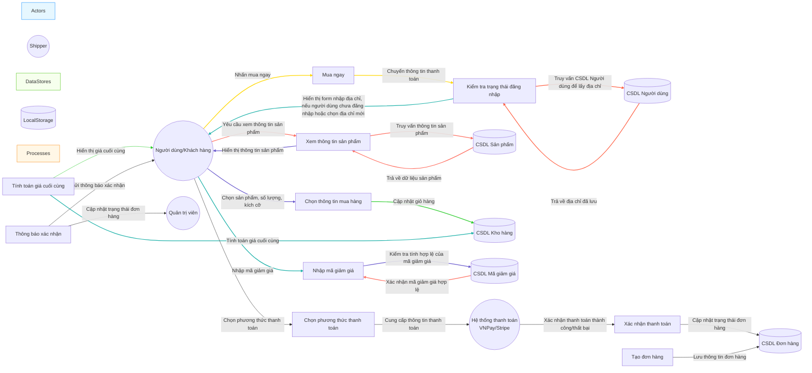

```mermaid
flowchart LR
    %% Các thực thể bên ngoài
    style Actors fill:#e6f7ff,stroke:#1890ff
    KhachHang((Người dùng/Khách hàng))
    ThanhToan((Hệ thống thanh toán<br>VNPay/Stripe))
    Shipper((Shipper))
    Admin((Quản trị viên))

    %% Các kho dữ liệu
    style DataStores fill:#f6ffed,stroke:#52c41a
    CSDL_SanPham[(CSDL Sản phẩm)]
    CSDL_KhoHang[(CSDL Kho hàng)]
    CSDL_NguoiDung[(CSDL Người dùng)]
    CSDL_DonHang[(CSDL Đơn hàng)]
    CSDL_MaGiamGia[(CSDL Mã giảm giá)]
    LocalStorage[(LocalStorage)]

    %% Các quy trình chính
    style Processes fill:#fff7e6,stroke:#fa8c16
    P1[Xem thông tin sản phẩm]
    P2[Chọn thông tin mua hàng]
    P3[Mua ngay]
    P4[Kiểm tra trạng thái đăng nhập]
    P5[Nhập mã giảm giá]
    P6[Tính toán giá cuối cùng]
    P7[Chọn phương thức thanh toán]
    P8[Xác nhận thanh toán]
    P9[Tạo đơn hàng]
    P10[Thông báo xác nhận]

    %% Luồng dữ liệu cho P1: Xem thông tin sản phẩm (màu #FF6F61)
    KhachHang -->|"Yêu cầu xem thông tin sản phẩm"| P1
    P1 -->|"Truy vấn thông tin sản phẩm"| CSDL_SanPham
    CSDL_SanPham -->|"Trả về dữ liệu sản phẩm"| P1
    P1 -->|"Hiển thị thông tin sản phẩm"| KhachHang
    linkStyle 0 stroke:#FF6F61,stroke-width:2
    linkStyle 1 stroke:#FF6F61,stroke-width:2
    linkStyle 2 stroke:#FF6F61,stroke-width:2

    %% Luồng dữ liệu cho P2: Chọn thông tin mua hàng (màu #6A5ACD)
    KhachHang -->|"Chọn sản phẩm, số lượng, kích cỡ"| P2
    P2 -->|"Cập nhật giỏ hàng"| CSDL_KhoHang
    linkStyle 3 stroke:#6A5ACD,stroke-width:2
    linkStyle 4 stroke:#6A5ACD,stroke-width:2

    %% Luồng dữ liệu cho P3: Mua ngay (màu #32CD32)
    KhachHang -->|"Nhấn mua ngay"| P3
    P3 -->|"Chuyển thông tin thanh toán"| P4
    linkStyle 5 stroke:#32CD32,stroke-width:2

    %% Luồng dữ liệu cho P4: Kiểm tra trạng thái đăng nhập (màu #FFD700)
    P4 -->|"Truy vấn CSDL Người dùng để lấy địa chỉ"| CSDL_NguoiDung
    CSDL_NguoiDung -->|"Trả về địa chỉ đã lưu"| P4
    P4 -->|"Hiển thị form nhập địa chỉ, nếu người dùng chưa đăng nhập hoặc chọn địa chỉ mới"| KhachHang
    linkStyle 6 stroke:#FFD700,stroke-width:2
    linkStyle 7 stroke:#FFD700,stroke-width:2

    %% Luồng dữ liệu cho P5: Nhập mã giảm giá (màu #FF6347)
    KhachHang -->|"Nhập mã giảm giá"| P5
    P5 -->|"Kiểm tra tính hợp lệ của mã giảm giá"| CSDL_MaGiamGia
    CSDL_MaGiamGia -->|"Xác nhận mã giảm giá hợp lệ"| P5
    linkStyle 8 stroke:#FF6347,stroke-width:2
    linkStyle 9 stroke:#FF6347,stroke-width:2

    %% Luồng dữ liệu cho P6: Tính toán giá cuối cùng (màu #20B2AA)
    P6 -->|"Tính toán giá cuối cùng"| CSDL_KhoHang
    P6 -->|"Hiển thị giá cuối cùng"| KhachHang
    linkStyle 10 stroke:#20B2AA,stroke-width:2
    linkStyle 11 stroke:#20B2AA,stroke-width:2

    %% Luồng dữ liệu cho P7: Chọn phương thức thanh toán (màu #6A5ACD)
    KhachHang -->|"Chọn phương thức thanh toán"| P7
    P7 -->|"Cung cấp thông tin thanh toán"| ThanhToan
    linkStyle 12 stroke:#6A5ACD,stroke-width:2

    %% Luồng dữ liệu cho P8: Xác nhận thanh toán (màu #FF6F61)
    ThanhToan -->|"Xác nhận thanh toán thành công/thất bại"| P8
    P8 -->|"Cập nhật trạng thái đơn hàng"| CSDL_DonHang
    linkStyle 13 stroke:#FF6F61,stroke-width:2

    %% Luồng dữ liệu cho P9: Tạo đơn hàng (màu #20B2AA)
    P9 -->|"Lưu thông tin đơn hàng"| CSDL_DonHang
    linkStyle 14 stroke:#20B2AA,stroke-width:2

    %% Luồng dữ liệu cho P10: Thông báo xác nhận (màu #32CD32)
    P10 -->|"Gửi thông báo xác nhận"| KhachHang
    P10 -->|"Cập nhật trạng thái đơn hàng"| Admin
    linkStyle 15 stroke:#32CD32,stroke-wid

```
