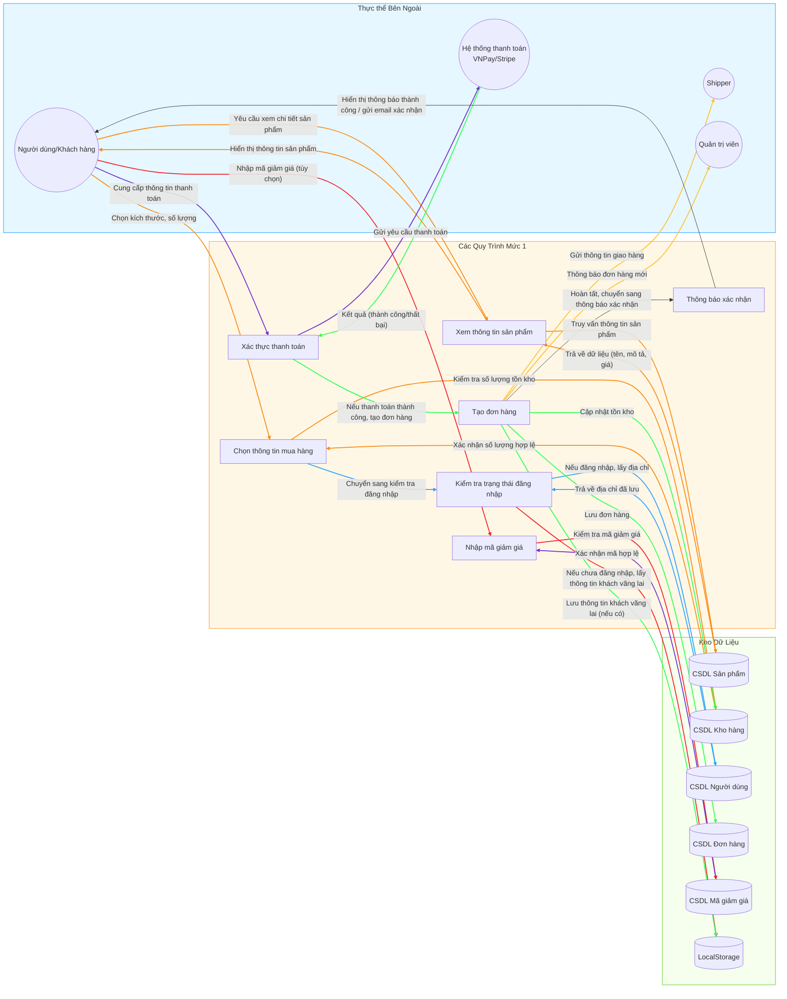

```mermaid
flowchart LR
%% Định nghĩa các thực thể bên ngoài
subgraph Actors [Thực thể Bên Ngoài]
direction TB
style Actors fill:#e6f7ff,stroke:#1890ff
KhachHang((Người dùng/Khách hàng))
ThanhToan((Hệ thống thanh toán<br>VNPay/Stripe))
Shipper((Shipper))
Admin((Quản trị viên))
end

    %% Định nghĩa các kho dữ liệu
    subgraph DataStores [Kho Dữ Liệu]
        direction TB
        style DataStores fill:#f6ffed,stroke:#52c41a
        CSDL_SanPham[(CSDL Sản phẩm)]
        CSDL_KhoHang[(CSDL Kho hàng)]
        CSDL_NguoiDung[(CSDL Người dùng)]
        CSDL_DonHang[(CSDL Đơn hàng)]
        CSDL_MaGiamGia[(CSDL Mã giảm giá)]
        LocalStorage[(LocalStorage)]
    end
    
    %% Định nghĩa các quy trình chính
    subgraph Processes [Các Quy Trình Mức 1]
        direction TB
        style Processes fill:#fff7e6,stroke:#fa8c16
        P1[Xem thông tin sản phẩm]
        P2[Chọn thông tin mua hàng]
        P3[Kiểm tra trạng thái đăng nhập]
        P4[Nhập mã giảm giá]
        P5[Tạo đơn hàng]
        P6[Xác thực thanh toán]
        P7[Thông báo xác nhận]
    end
    
    %% Luồng dữ liệu cho P1: Xem thông tin sản phẩm
    KhachHang -->|"Yêu cầu xem chi tiết sản phẩm"| P1
    P1 -->|"Truy vấn thông tin sản phẩm"| CSDL_SanPham
    CSDL_SanPham -->|"Trả về dữ liệu (tên, mô tả, giá)"| P1
    P1 -->|"Hiển thị thông tin sản phẩm"| KhachHang
    linkStyle 0 stroke:#fa8c16,stroke-width:2
    linkStyle 1 stroke:#fa8c16,stroke-width:2
    linkStyle 2 stroke:#fa8c16,stroke-width:2
    linkStyle 3 stroke:#fa8c16,stroke-width:2

    %% Luồng dữ liệu cho P2: Chọn thông tin mua hàng
    KhachHang -->|"Chọn kích thước, số lượng"| P2
    P2 -->|"Kiểm tra số lượng tồn kho"| CSDL_KhoHang
    CSDL_KhoHang -->|"Xác nhận số lượng hợp lệ"| P2
    linkStyle 4 stroke:#fa8c16,stroke-width:2
    linkStyle 5 stroke:#fa8c16,stroke-width:2
    linkStyle 6 stroke:#fa8c16,stroke-width:2

    %% Luồng dữ liệu cho P3: Kiểm tra trạng thái đăng nhập
    P2 -->|"Chuyển sang kiểm tra đăng nhập"| P3
    P3 -->|"Nếu đăng nhập, lấy địa chỉ"| CSDL_NguoiDung
    CSDL_NguoiDung -->|"Trả về địa chỉ đã lưu"| P3
    P3 -->|"Nếu chưa đăng nhập, lấy thông tin khách vãng lai"| LocalStorage
    linkStyle 7 stroke:#33A1FF,stroke-width:2
    linkStyle 8 stroke:#33A1FF,stroke-width:2
    linkStyle 9 stroke:#33A1FF,stroke-width:2

    %% Luồng dữ liệu cho P4: Nhập mã giảm giá
    KhachHang -->|"Nhập mã giảm giá (tùy chọn)"| P4
    P4 -->|"Kiểm tra mã giảm giá"| CSDL_MaGiamGia
    CSDL_MaGiamGia -->|"Xác nhận mã hợp lệ"| P4
    linkStyle 10 stroke:#f5222d,stroke-width:2
    linkStyle 11 stroke:#f5222d,stroke-width:2
    linkStyle 12 stroke:#f5222d,stroke-width:2

    %% Luồng dữ liệu cho P6: Xác thực thanh toán
    KhachHang -->|"Cung cấp thông tin thanh toán"| P6
    P6 -->|"Gửi yêu cầu thanh toán"| ThanhToan
    ThanhToan -->|"Kết quả (thành công/thất bại)"| P6
    linkStyle 13 stroke:#722ed1,stroke-width:2
    linkStyle 14 stroke:#722ed1,stroke-width:2
    linkStyle 15 stroke:#722ed1,stroke-width:2

    %% Luồng dữ liệu cho P5: Tạo đơn hàng (sau khi thanh toán thành công)
    P6 -->|"Nếu thanh toán thành công, tạo đơn hàng"| P5
    P5 -->|"Lưu đơn hàng"| CSDL_DonHang
    P5 -->|"Cập nhật tồn kho"| CSDL_KhoHang
    P5 -->|"Lưu thông tin khách vãng lai (nếu có)"| LocalStorage
    P5 -->|"Gửi thông tin giao hàng"| Shipper
    P5 -->|"Thông báo đơn hàng mới"| Admin
    linkStyle 16 stroke:#33FF57,stroke-width:2
    linkStyle 17 stroke:#33FF57,stroke-width:2
    linkStyle 18 stroke:#33FF57,stroke-width:2
    linkStyle 19 stroke:#33FF57,stroke-width:2
    linkStyle 20 stroke:#33FF57,stroke-width:2

    %% Luồng dữ liệu cho P7: Thông báo xác nhận
    P5 -->|"Hoàn tất, chuyển sang thông báo xác nhận"| P7
    P7 -->|"Hiển thị thông báo thành công / gửi email xác nhận"| KhachHang
    linkStyle 21 stroke:#FFC133,stroke-width:2
    linkStyle 22 stroke:#FFC133,stroke-width:2

```